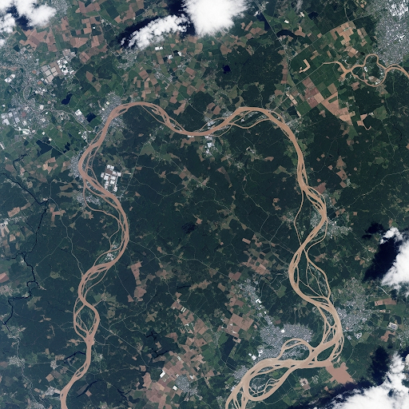
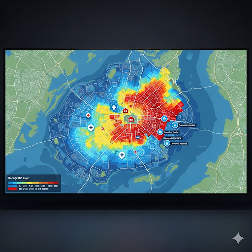

# The Story of Data and the Mighty Floods in Punjab 

Once, in a vast and beautiful land like Punjab, where mighty rivers flow and fields stretch wide, the clouds would sometimes gather, and the rain would fall, and fall, and fall. These were the mighty floods, like those experienced recently in Pakistan, and they brought great sadness. Homes were washed away, crops were ruined, and families had to leave everything behind. It felt like nature was just too strong, and we could only watch.

---

## A New Helper Arrives: Data! 

But then, clever people started to think: "What if we could understand these floods better? What if we could see them coming, or know where they would hit hardest?" This is where a special helper called **Data** stepped in. Think of Data as a huge collection of clues and information.

### 1. Whispers from the Sky: Predicting Floods 

Imagine a group of smart people in a special room. They're not just looking out the window; they're listening to the whispers of Data.

* **Old Rain Stories:** Data remembers all the times it rained before, how much, and what happened. It looks at river levels from many years ago.
  
* **Weather Clues:** It listens to today's weather forecasts, knowing how much rain is coming.
  
* **River Sentinels:** Tiny helpers, like little spies, are placed in rivers. They send constant messages about how high the water is getting.
  
* **Eyes from Space:** Even satellites high above look down, showing how wet the ground is and if rivers are starting to swell.
  

By putting all these clues together, Data can whisper: "A big flood might be coming to Punjab soon! Get ready!" This gives people time to prepare.

### 2. Knowing Our Weak Spots: Mapping Danger 

It's one thing to know a flood is coming, but another to know *who* needs help most. Data helps us draw a special map of our community.

* **Homes and Hospitals:** This map shows where all the houses are, where the hospitals are, and even where the roads might get blocked.
* **Those Who Need More Help:** Data helps us find areas where there are more older people, or families who might not have cars to leave quickly. These are our "weak spots" that need extra care.

This map helps us know exactly where to send help first when trouble arrives.

### 3. Helping Hand: Getting Aid Where It's Needed 

When the flood waters rise, every minute counts. Data becomes a guide, showing us the best paths.

* **Smart Roads:** Data knows which roads are flooded and which are still safe. It helps rescue teams find the quickest way to reach people who are stuck.
* **Quick Look at Damage:** After the water goes down, little flying machines (drones) can take pictures. Data looks at these pictures quickly to see which houses are broken and which fields are destroyed, so help can be sent to rebuild faster.

---

## Our Future with Data: Stronger Against Floods 

In a place like Punjab, we've seen how strong floods can be, especially with the way our climate is changing. It feels like the weather is becoming more unpredictable. But with Data as our friend, we don't have to just hope for the best.

Data helps us listen to the earth, see the danger, and act smartly. It helps us prepare, protect our families, and rebuild faster. It's like having a wise old elder who knows all the signs and helps us stay safe. With Data, we are building a stronger, safer future, ready for whatever the skies may bring to Punjab.