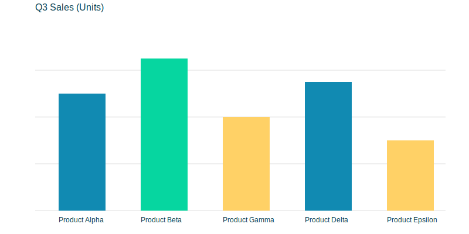
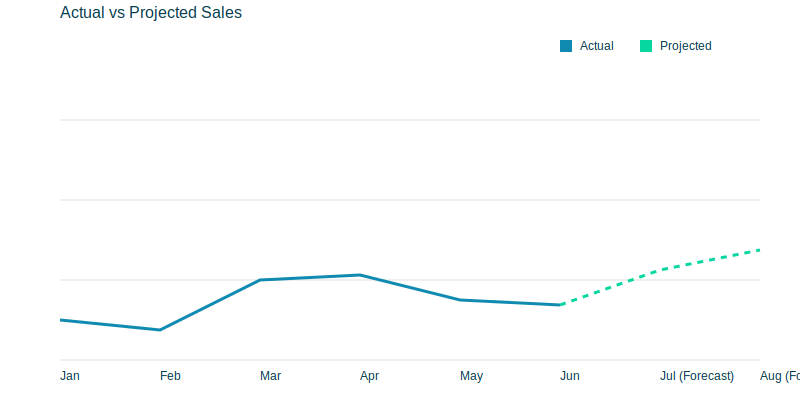
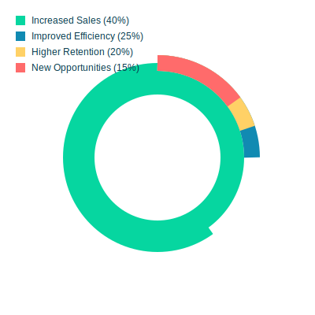

# From Data Chaos to Business Clarity

The journey from raw information to tangible results is the most critical process for growth. Here's a friendly walkthrough of how messy data turns into business outcomes you can trust.

## The Data-to-Value Pipeline

1. Messy Data — Raw, inconsistent, and incomplete.
2. Cleaning — Fix errors and create consistency.
3. Analysis & Modeling — Find patterns and predict outcomes.
4. Delivery — Dashboard/API that people can use.

## Visualizing the Value at Each Stage

### Stage 3: Analysis Finds Insights
A bar chart compares categories to reveal top performers and laggards.

### Stage 3: Modeling Predicts the Future
A line chart shows history and forecast, moving decisions from reactive to proactive.

### Stage 4: Delivering Business Outcomes
A donut chart summarizes impact across the business.

---

This is how you show you're serious. Turning data into outcomes is the engine of modern growth and advantage.
